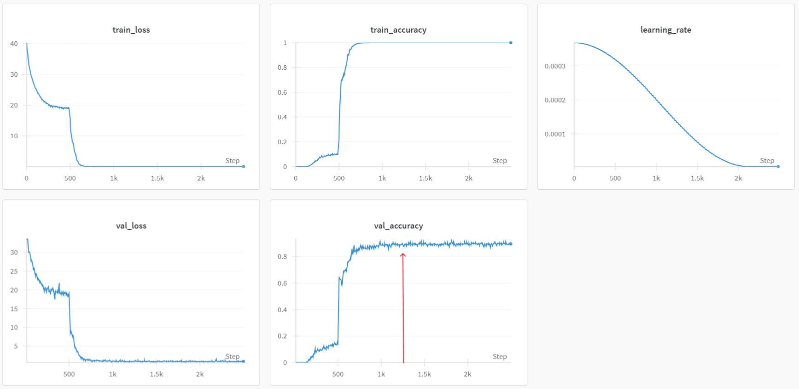

# FaceMind
FaceMind：基于OpenCV + RetinaFace + ArcFace的深度学习实时人脸识别系统


## 目录
- [技术和库](#技术和库)
- [实现功能](#实现功能)
- [工作流程](#工作流程)
- [项目结构](#项目结构)
- [模型训练](#模型训练)
- [快速开始](#快速开始)
- [License](#license)
- [Contribution](#contribution)
- [Reference](#reference)
- [联系我们](#联系我们)

## 技术和库

- **OpenCV**: 用于摄像头实时拍摄和图像处理。
- **InsightFace ( RetinaFace + ArcFace )**: 用于人脸检测、对齐和识别。
- **SQLite**: 用于存储人脸数据和用户信息的数据库。
- **Gradio**: 用于创建前端界面。

## 实现功能
本系统提供两种模式，分别为 Web 模式和 Local 模式  

**1.Web 模式**：  
由 Gradio 实现，提供网页 `拍摄/上传视频进行人脸识别`、`拍摄/上传照片进行人脸识别`和`拍摄/上传照片进行人脸录入`功能

**_示例_**：  
_Web 界面首页_


_Web 模式人脸录入_


_Web 模式人脸识别_


**2.Local 模式**：  
由OpenCV实现，提供本地`实时拍摄进行人脸识别`和`实时拍摄进行人脸识别`功能

_**示例**_：  
_Local 模式实时人脸录入_


_Local 模式实时人脸识别（支持持续识别）_


## 工作流程


**1. 摄像头实时拍摄**  
    使用OpenCV调用本地摄像头并捕捉实时视频流。


**2. 人脸检测、对齐与识别**
人脸识别的操作包括：  
  - ***人脸检测***（即从原始图像中检测出人脸目标框）
  - ***关键点提取***（以关键点标识人脸的五官）
  - ***仿射变换对齐***（通过平移、放缩、旋转等仿射变换把人脸图像转换成标准形式）
  - ***人脸识别***（对人脸图像进行Embedding，后续与数据库已知人脸计算相似度来匹配）  

*这里使用 InsightFace 库来实现对实时视频流的人脸识别。 InsightFace 集成了 RetinaFace 和 ArcFace ， RetinaFace 用于实现人脸检测和关键点提取，对图像的人脸区域进行仿射变换对齐和裁剪后给到 ArcFace ，ArcFace 对人脸图像进行 embedding ；并用当前这个人脸 embedding 和数据库中所有的已知人脸 embedding 计算 cos 相似度，匹配最相似的已录入人脸（未见过的人脸输出 "Unknown" ），最后把目标框和人名输出回原始图像。*

**3. 数据库支持**  
    使用 SQLite 数据库存储已知人脸的编码和姓名信息。


**4. 前端界面**  
    使用 Gradio 创建一个方便用户交互的Web界面。

## 项目结构
```
FaceMind/
├── LICENSE                        # 许可证文件
├── README.md                      # 项目说明文档
├── requirements.txt               # 项目依赖文件
├── client.py                      # 系统入口脚本（用户可自主选择运行模式和模型）
├── .gitignore                     # Git 忽略规则
│
├── SQL/                           # 数据库相关模块
│   └── database_operate.py        # 数据库操作函数（如人脸数据的存取）
│
├── UI/                            # 前端界面模块（Gradio 实现）
│   └── front_end.py               # Gradio 前端界面实现代码
│
├── camera/                        # 本地摄像头拍摄模块
│   └── video_capture.py           # 提供调用本地摄像头实现 Local 模式
│
├── face_process/                  # 人脸处理模块
│   ├── init_InsightFace.py        # InsightFace 模型初始化（包括下载 ArcFace 模型的逻辑）
│   ├── face_enroll.py             # 人脸录入实现代码
│   └── face_recognize.py          # 人脸识别及处理的核心逻辑
│
├── arcface_train/                 # 模型训练相关模块
│   ├── README.md                  # CASIA_FaceV5 数据集地址
│   └── data_process.py            # 对 CASIA_FaceV5 数据集清洗并数据增强的代码
│
├── merge/                         # 整合模块（把所有模块整合成完整的系统）
│   ├── mode.py                    # 系统模式的枚举类
│   └── facemind.py                # 整合所有模块的代码
│[databases](databases)
├── databases/                     # 用于存放 SQLite 数据库文件
│   └── known_faces.db             # 已知人脸数据库文件（系统运行时会自动创建，如果中途换了 ArcFace 模型，要重新构建，不同 ArcFace 模型的 embedding 不同 ）
│
├── gradio_temp/                   # 用于存放 Gradio 的临时文件（使用 Web 模式时，会自动创建）
│
├── README_images/                 # README 中使用的图片
│   └── draw_image.py              # 用于绘制 RetinaFace 处理的结果
│
└── .insightface/                  # 默认下载的模型存放目录
    └── models/                    # 存放下载的各类模型文件（系统默认下载的模型会以该路径为根目录）
```


## 模型训练
本项目使用自主清洗并数据增强的亚洲人脸数据集 [CASIA_FaceV5](https://modelscope.cn/datasets/JustinLeee/Cleaned_Augmented_CASIA_FaceV5) 对以 `iResNet50` 为基座的 [ArcFace](https://modelscope.cn/models/JustinLeee/FaceMind_ArcFace_iResNet50_CASIA_FaceV5) 进行了微调。  

训练的代码和预训练模型来自GitHub大佬：https://github.com/bubbliiiing/arcface-pytorch

**训练记录如下**：  
epoch = 100, learning_rate = 1e-4, lr_decay_type = cos, warm_up = False, batch_size = 224, loss_function = ArcFaceLoss, margin = 0.5, scale = 64, optimizer = Adam, momentum = 0.9, weight_decay = 0  

dataset有500个人，每个人5张照片，每张照片会有12种数据增强的操作（即每个人65张照片）



因为数据集比较小的缘故，整个训练过程其实是过拟合了的，所以最终选用的模型是 epoch = 50 的模型（图中红色箭头的位置）。  
且因预训练模型的能力不太强，所以实际效果没有 InsightFace 官方默认的 ArcFace 模型好，最终系统默认采用的还是 InsightFace 官方默认的 ArcFace 模型。

## 快速开始
本项目基于 python 3.11 进行开发

1.**克隆仓库**： 
```bash
  git clone https://github.com/Justin-ljw/FaceMind.git
```
2.**安装依赖**：
```shell
  pip install -r requirements.txt
```
3.**运行客户端脚本**：
```shell
  # client.py 脚本为系统入口，用户可以自主选择运行模式和所用模型（内有详细注释）
  python client.py
```

## License
- 本项目签署了 `Apache 2.0` 许可证，详情请参阅 [LCENSE](LICENSE)  
- 本项目只可用于个人学习研究，不可用于商用

## Contribution
本仓库代码由个人独立完成

## Reference
- _**RetinaFace**_ 论文地址：https://arxiv.org/abs/1905.00641
- _**ArcFace**_ 论文地址：https://arxiv.org/abs/1801.07698
- _**InsightFace**_ 官方仓库地址：https://github.com/deepinsight/insightface
- _**CASIA_FaceV5**_ 原始数据集地址：http://biometrics.idealtest.org/dbDetailForUser.do#/datasetDetail/9
- ***训练的代码和预训练模型***的仓库地址：https://github.com/bubbliiiing/arcface-pytorch
- ***自主***清洗并数据增强的 CASIA_FaceV5 数据集地址：https://modelscope.cn/datasets/JustinLeee/Cleaned_Augmented_CASIA_FaceV5
- ***自主***微调的 ArcFace 模型地址：https://modelscope.cn/models/JustinLeee/FaceMind_ArcFace_iResNet50_CASIA_FaceV5

## 联系我们
- ***本项目***地址：https://github.com/Justin-ljw/FaceMind  
- _**e-mail**_：ljw15999715853@qq.com
- _**Hugging Face**_：https://huggingface.co/JustinLeee
- _**ModelScope**_：https://modelscope.cn/profile/JustinLeee
- _**CSDN**_：https://blog.csdn.net/justin_ljw